# Архитектура доработок системы "Управление парком аттракционов"

## Обзор доработок

Данный документ описывает архитектуру доработок существующей системы управления парком аттракционов для реализации возможности онлайн продажи билетов через REST API.

## 1. Общая архитектура решения

### 1.1 Архитектурная схема

Система будет расширена следующими компонентами:
- REST API веб-сервис
- Система бронирования билетов
- Интеграция с внешними платежными системами
- Расширенная система контроля остатков

### 1.2 Диаграмма общей архитектуры

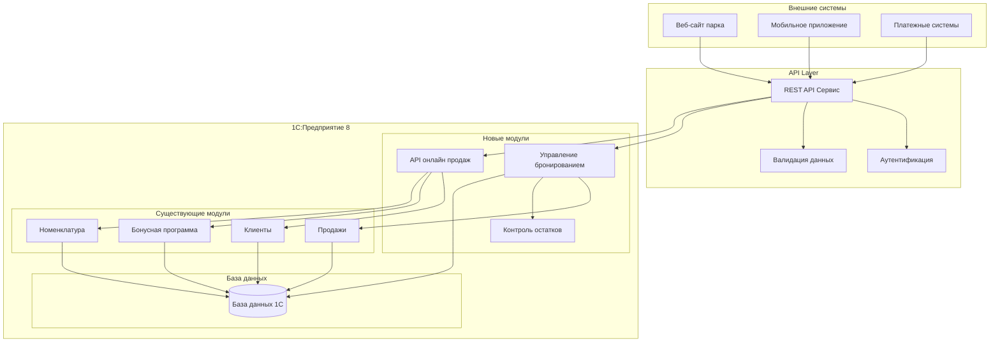

## 2. Новые объекты метаданных

### 2.1 Структура новых объектов

#### Документ "БронированиеБилетов"
- **Назначение**: Фиксация онлайн бронирования билетов
- **Статусы**: Активная, Оплачена, Отменена, Истекла
- **Движения по регистрам**: БронированиеПосещений

#### Регистр накопления "БронированиеПосещений"
- **Назначение**: Учет забронированных посещений для контроля доступности
- **Измерения**: БронированиеБилетов, ВидАттракциона
- **Ресурсы**: КоличествоПосещений

#### Перечисление "СтатусыБронирования"
- Активная
- Оплачена
- Отменена
- Истекла

### 2.2 Диаграмма структуры данных

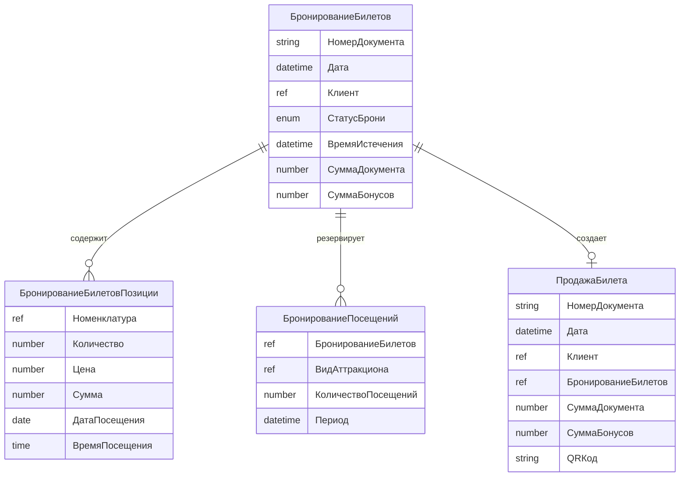

## 3. API Архитектура

### 3.1 REST API Endpoints

#### Основные группы endpoints:
- `/api/v1/products` - Управление номенклатурой
- `/api/v1/customers` - Управление клиентами
- `/api/v1/reservations` - Система бронирования
- `/api/v1/tickets` - Управление билетами

### 3.2 Диаграмма API архитектуры

```mermaid
graph LR
    subgraph "API Endpoints"
        PROD[/products]
        CUST[/customers]
        RES[/reservations]
        TICK[/tickets]
    end
    
    subgraph "API Controllers"
        PROD_CTRL[ProductsController]
        CUST_CTRL[CustomersController]
        RES_CTRL[ReservationsController]
        TICK_CTRL[TicketsController]
    end
    
    subgraph "Business Logic"
        PROD_BL[Управление номенклатурой]
        CUST_BL[Управление клиентами]
        RES_BL[Управление бронированием]
        TICK_BL[Управление билетами]
    end
    
    subgraph "Data Access"
        CATALOG_DA[Справочник.Номенклатура]
        CLIENT_DA[Справочник.Клиенты]
        BOOKING_DA[Документ.БронированиеБилетов]
        SALES_DA[Документ.ПродажаБилета]
    end
    
    PROD --> PROD_CTRL --> PROD_BL --> CATALOG_DA
    CUST --> CUST_CTRL --> CUST_BL --> CLIENT_DA
    RES --> RES_CTRL --> RES_BL --> BOOKING_DA
    TICK --> TICK_CTRL --> TICK_BL --> SALES_DA
```

## 4. Бизнес-процессы

### 4.1 Процесс онлайн бронирования

#### Диаграмма процесса бронирования

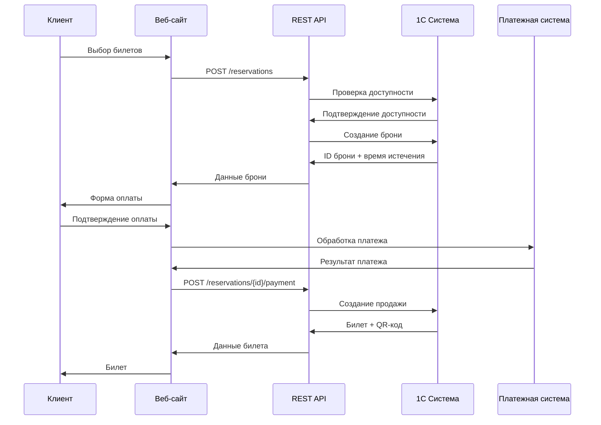

### 4.2 Процесс контроля остатков

#### Диаграмма контроля остатков

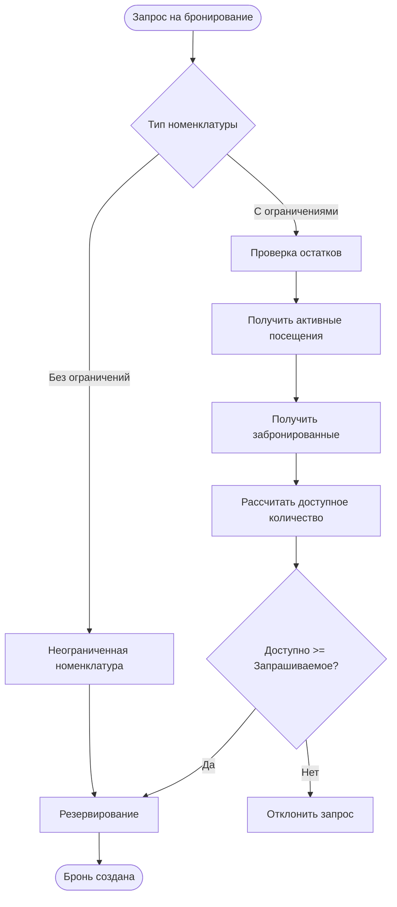

### 4.3 Процесс управления истекшими бронями

#### Диаграмма очистки истекших броней

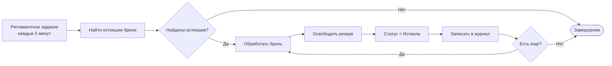

## 5. Интеграция с существующей системой

### 5.1 Точки интеграции

#### Диаграмма интеграции

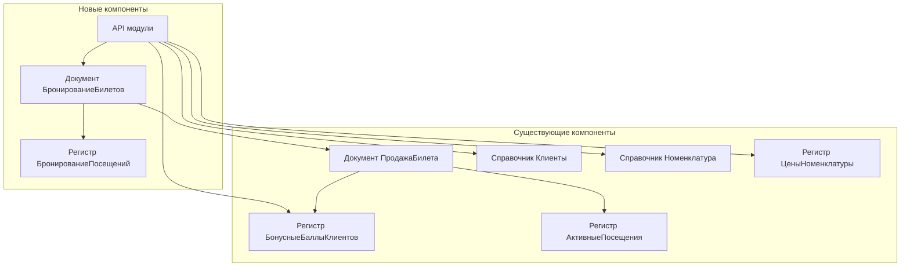

### 5.2 Модификации существующих объектов

#### Документ "ПродажаБилета"
- **Новый реквизит**: БронированиеБилетов (связь с онлайн бронью)
- **Модификация проведения**: Автоматическое освобождение резерва при создании из брони

## 6. Производительность

### 6.1 Оптимизация производительности

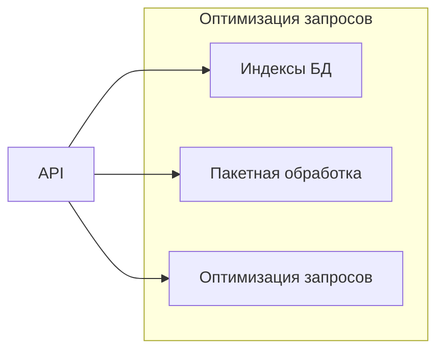

## 7. Этапы реализации

### 7.1 План разработки

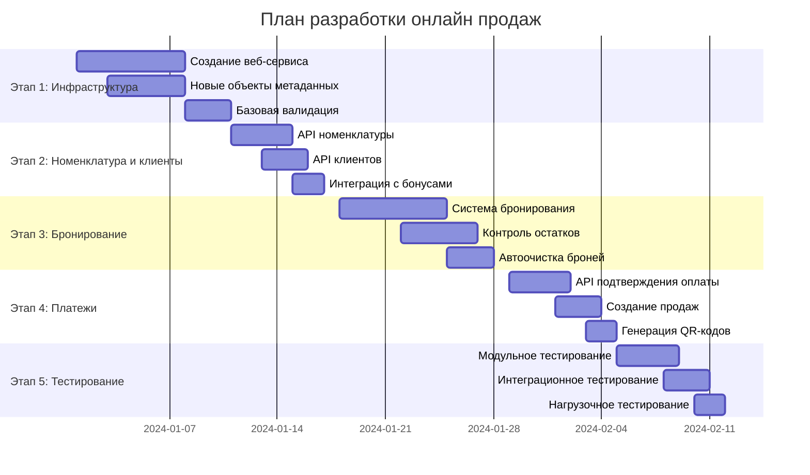

### 7.2 Диаграмма зависимостей компонентов

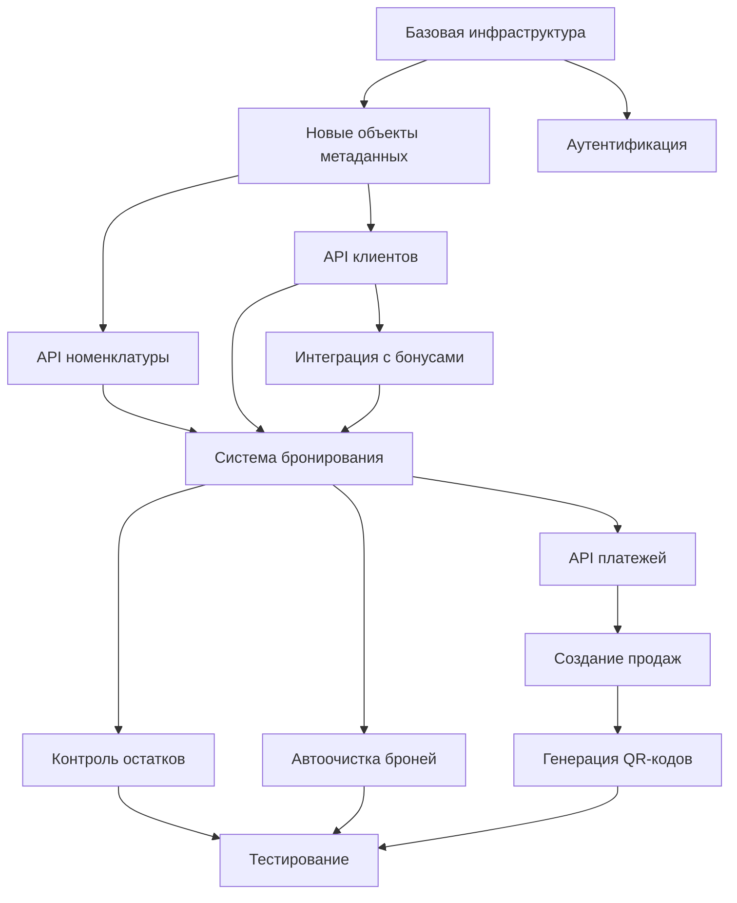

## 8. Поддержка системы

### 8.1 Базовые требования к поддержке

- **Резервное копирование**: Регулярное резервное копирование базы данных 1С
- **Обновления**: Контролируемое обновление платформы 1С:Предприятие
- **Документация**: Ведение технической документации изменений
- **Тестирование**: Регулярное тестирование работоспособности API

## 9. Детализация компонентов системы

### 9.1 Архитектура общих модулей

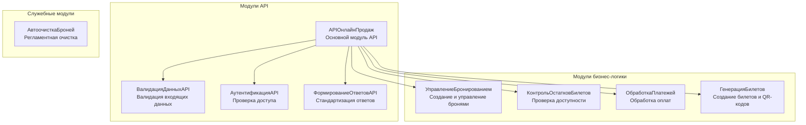

### 9.2 Диаграмма состояний брони

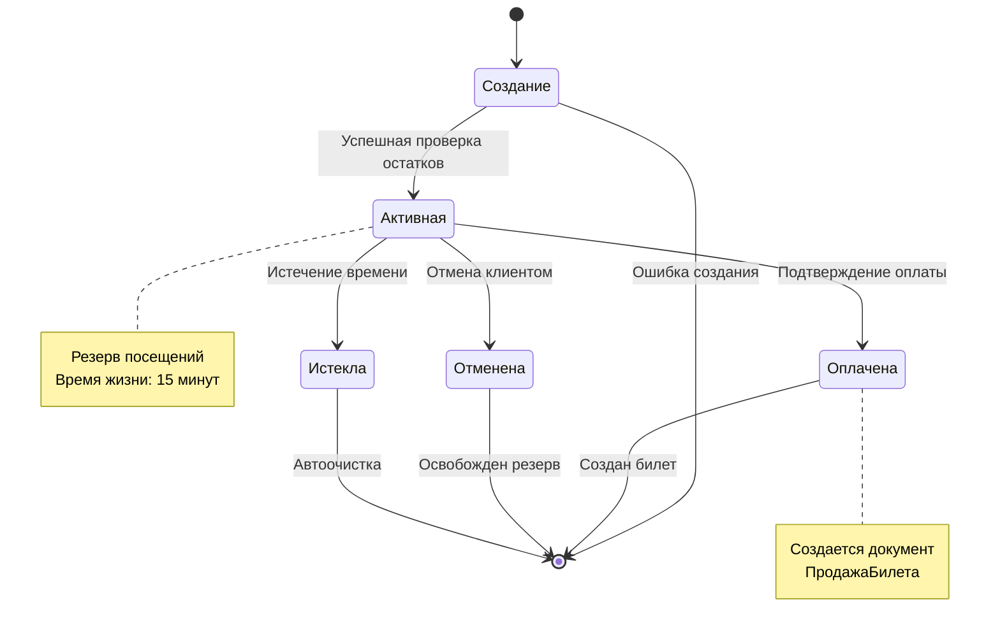

### 9.3 Обработка ошибок

Система обрабатывает основные типы ошибок:
- **400 Bad Request** - ошибки валидации входящих данных
- **404 Not Found** - запрашиваемый ресурс не найден  
- **409 Conflict** - бизнес-ошибки (недостаточно остатков, бронь истекла)
- **500 Internal Server Error** - системные ошибки

### 9.4 Диаграмма взаимодействия с бонусной программой

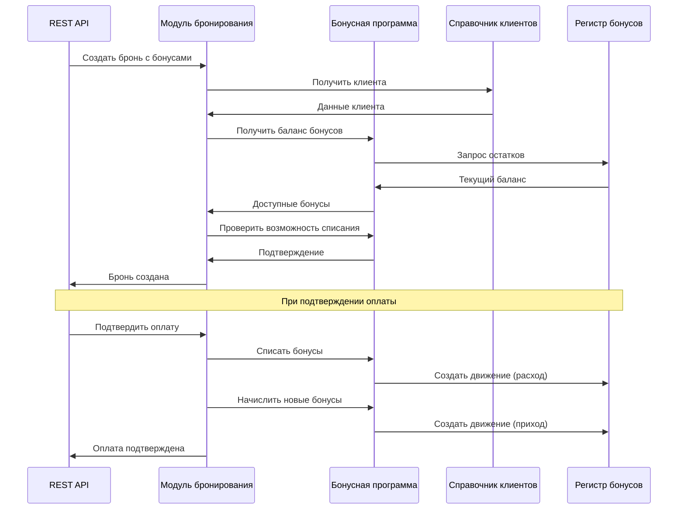

## 10. Техническая спецификация API

### 10.1 Структура JSON ответов

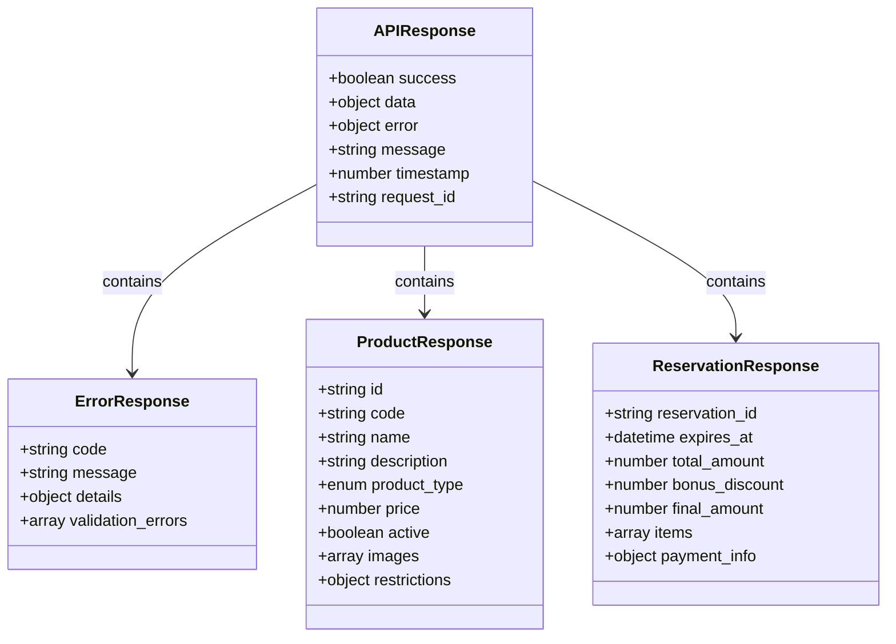

### 10.2 Валидация данных

Система выполняет валидацию входящих данных на нескольких уровнях:

1. **Синтаксическая валидация** - проверка корректности JSON структуры
2. **Семантическая валидация** - проверка соответствия бизнес-правилам
3. **Бизнес-валидация** - проверка остатков, существования ресурсов

## 11. Стратегия развертывания

### 11.1 Схема развертывания

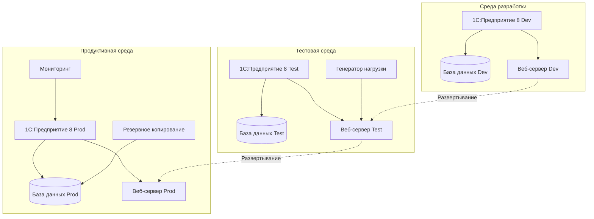

### 11.2 Стратегия миграции данных

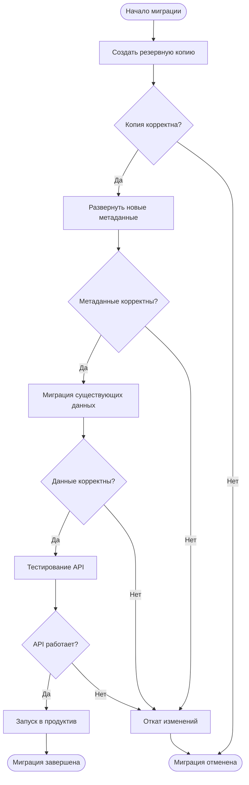

## 12. Заключение

Предложенная архитектура доработок обеспечивает:

1. **Интеграцию с существующей системой** без нарушения текущих бизнес-процессов
2. **Масштабируемость** для обработки большого количества онлайн заказов
3. **Надежность** через систему бронирования с автоматической очисткой
4. **Производительность** через оптимизацию запросов к базе данных
5. **Отказоустойчивость** через обработку ошибок и стратегию развертывания

### 12.1 Ключевые преимущества архитектуры

- **Модульность**: Четкое разделение ответственности между компонентами
- **Расширяемость**: Возможность добавления новых функций без изменения базовой архитектуры
- **Совместимость**: Полная совместимость с существующими бизнес-процессами
- **Производительность**: Оптимизированные алгоритмы работы с данными

### 12.2 Риски и их митигация

| Риск | Вероятность | Влияние | Митигация |
|------|-------------|---------|-----------|
| Проблемы производительности | Средняя | Высокое | Нагрузочное тестирование, оптимизация запросов |
| Ошибки интеграции | Низкая | Высокое | Комплексное тестирование, поэтапное развертывание |

| Сложность поддержки | Средняя | Среднее | Подробная документация, обучение команды |

Реализация займет приблизительно 7 недель и потребует тесной координации с командой разработки внешнего веб-сайта для обеспечения корректной интеграции.
